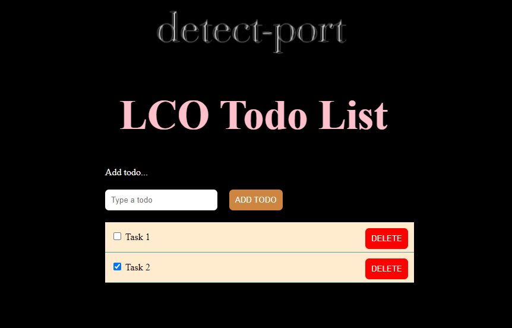

# Todo List Angular project

### This is quite simpleapp where we can add todo list and delete todo list.

### Very simple add button perform to push value in list array.

```script
 addItem() {
   if (this.todoValue !== "") {
     const newItem: Todo = {
       id: Date.now(),
       value: this.todoValue,
       isDone:false
     };
     this.list.push(newItem);
   }
   this.todoValue = "";
 }
```

### Delete function is filtering by id.

```script
deleteItem(id:number) {
   this.list = this.list.filter(item => item.id !== id);
 }
```

## Images


